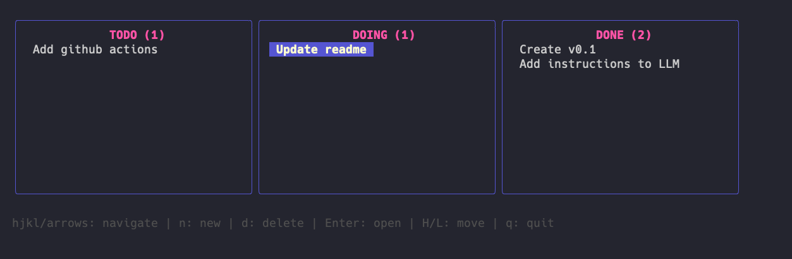
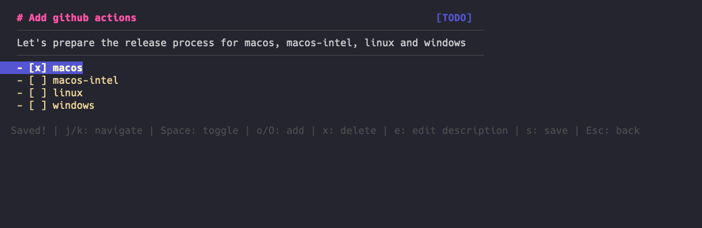

# Doings - Terminal Task Board

A solo-developer, local-first TUI application for managing tasks using Markdown files.

## Use Cases

### Perfect For:
- Solo developers managing personal tasks
- Local-first workflow enthusiasts
- Developers who live in the terminal
- Quick task capture and management
- Simple kanban-style project tracking

### Not For:
- Team collaboration (no sync/sharing)
- Complex project management
- Mobile/web access
- Real-time updates across devices

## Features

### Board View



- **Kanban-style columns** with customizable statuses
- **Vim-style navigation** (hjkl or arrow keys)
- **Create tasks** quickly with 'n' key
- **Move tasks** between columns with H/L keys
- **Delete tasks** with confirmation

### Detail View



- **Full task display** with title, status, description, and checklist
- **Navigate checklist** with j/k keys
- **Toggle checkboxes** with Space
- **Add items** with o (below) or O (above)

## Quick Start

### Build
```bash
go build
```

### Run
```bash
./doings
```

On first run, the application will:
1. Create `.tasks/` directory
2. Generate default `config.toml`
3. Show empty state with instructions

You can then commit this folder or decide to ignore it. It's up to you!

## AI Disclaimer

This project was totally generated by https://opencode.ai with model Claude Sonnet 4.5, therefore use at your own risk. The code may contain bugs, security vulnerabilities, or other issues. Always review and test the code before using it in production. The author is not responsible for any damage or loss caused by using this software.

### Instructions for AI

The following files were used as input to the AI model:
- [instructions.md](instructions.md)
- [00-overview.md](plan/00-overview.md)
- [01-project-setup.md](plan/01-project-setup.md)
- [02-config-file-structure.md](plan/02-config-file-structure.md)
- [03-task-parsing.md](plan/03-task-parsing.md)
- [04-task-crud.md](plan/04-task-crud.md)
- [05-board-model-navigation.md](plan/05-board-model-navigation.md)
- [06-board-view-rendering.md](plan/06-board-view-rendering.md)
- [07-task-movement-crud.md](plan/07-task-movement-crud.md)
- [08-task-detail-view.md](plan/08-task-detail-view.md)
- [09-checklist-editing.md](plan/09-checklist-editing.md)
- [10-polish-error-handling.md](plan/10-polish-error-handling.md)
